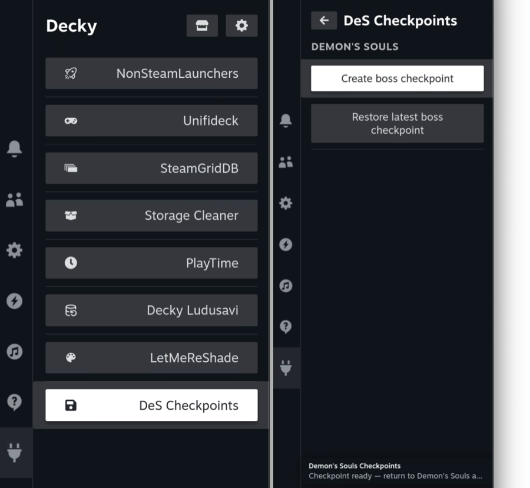
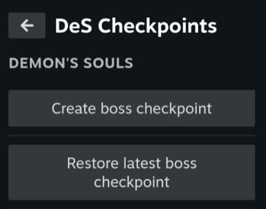
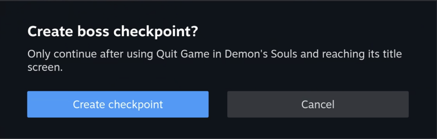

# DeS Checkpoints

> A tiny Decky plugin for the moment you are standing outside a boss fog gate,
> feeling heroic, and would like to keep it that way.

**DeS Checkpoints** creates and restores a verified checkpoint for the PS3
version of *Demon's Souls* (`BLUS30443`) in [RPCS3](https://rpcs3.net/). It is
made for the classic loop: reach fog gate, make checkpoint, die horribly,
restore checkpoint, pretend nothing happened.

It was created because RPCS3's save-state route was not useful for this setup,
while manually juggling save files in Gaming Mode is a little too exciting.

## What it does

| Action | Result |
| --- | --- |
| **Create boss checkpoint** | Makes a verified copy of the current Demon’s Souls save. |
| **Restore latest boss checkpoint** | Verifies the checkpoint, preserves the current save as a recovery copy, then restores the checkpoint. |

No save is overwritten until the replacement has been staged and checked. The
plugin keeps ten verified checkpoints and ten pre-restore recovery copies, so
there is a limit on file clutter as well as on emotional damage.

## Requirements

- *Demon's Souls* (US, `BLUS30443`) running in the standalone
  [RPCS3 Flatpak](https://flathub.org/apps/net.rpcs3.RPCS3).
- [Decky Loader](https://decky.xyz/) in Steam Gaming Mode.
- A system using that standard Flatpak save location:

  ```text
  $HOME/.var/app/net.rpcs3.RPCS3/config/rpcs3/dev_hdd0/home/00000001/savedata/BLUS30443DEMONSS005
  ```

Tested on **Bazzite**. It is designed for **SteamOS**, Bazzite, and comparable
Linux Gaming Mode setups that use Decky Loader and the same standalone RPCS3
Flatpak layout. Bazzite documents Decky installation and support in its
[handheld guide](https://docs.bazzite.gg/Handheld_and_HTPC_edition/Handheld_Wiki/).
Native RPCS3, AppImage installs, and custom save locations need a small path
change before use.

## Install

1. Download `demons-souls-checkpoints.zip` from the
   [latest GitHub Release](https://github.com/marcodallagatta/decky-demons-souls-save-restore/releases/latest).
2. In Gaming Mode, open Quick Access (`…`) → Decky → Settings → Developer.
3. Choose **Install plugin from ZIP file**, then select the downloaded ZIP.
4. Open Quick Access (`…`) → Decky → **DeS Checkpoints**.

The plugin needs no root access. If Decky is not installed yet, start with its
[official installation guide](https://decky.xyz/).

## In Gaming Mode

After installation, find **DeS Checkpoints** in Decky's plugin list. Its two
actions are deliberately kept on one small screen: create a checkpoint before
the fight, or restore the latest one after a loss.





Creating a checkpoint requires confirmation after you have quit to the game's
title screen. When it succeeds, Decky shows a notification before you return
to the game.



## The boss-gate ritual

1. Stand at the fog gate.
2. Use *Demon's Souls*’ own **Quit Game** option and wait for its title screen.
   Leave RPCS3 open.
3. Open Decky → **DeS Checkpoints** → **Create boss checkpoint**.
4. Wait for the “Checkpoint ready” notification, then continue the game.
5. Fight the boss. This section is traditionally where confidence is punished.
6. After respawning, use **Quit Game** again and wait for the title screen.
7. Choose **Restore latest boss checkpoint**, confirm, and wait for its
   notification.
8. Continue/load the game. You should be back at the fog gate.

## Very important save safety bit

Do **not** run either action while the game is actively playing or loading.
Return to the game's own title screen first. The plugin checks that the save
tree remains unchanged for five seconds before it does anything, but it cannot
telepathically stop an emulator from writing a save halfway through a fight.

The live save stays in place here:

```text
$HOME/.var/app/net.rpcs3.RPCS3/config/rpcs3/dev_hdd0/home/00000001/savedata/BLUS30443DEMONSS005
```

Copies live here:

```text
$HOME/.local/share/rpcs3-save-vault/demons-souls-BLUS30443/
```

If a restore reports a failure, do not continue into the game. Read the error
first. The newest verified pre-restore copy is your recovery point.

## Build from source

```bash
pnpm install
bash scripts/package.sh
```

The installable archive is written to:

```text
release/demons-souls-checkpoints.zip
```

For releases, attach that ZIP to the GitHub Release. Keeping the archive as a
release asset means players get one obvious download, while the repository
remains the readable source code rather than a pile of increasingly suspicious
ZIP files.

## Legal and copyright

This is an independent save-management plugin. It is not affiliated with or
endorsed by Sony, PlayStation, FromSoftware, or RPCS3.

This repository and its releases contain only this plugin's code. It does not
include any game files, disc images, game assets, music, artwork, or other
copyrighted *Demon's Souls* content. It does not include PlayStation 3
firmware, keys, or tools for obtaining them.

Use it only with games and system files you own and have lawfully dumped for
your own use, subject to the law where you live. You are responsible for the
files you use with RPCS3. This is a practical project note, not legal advice.

## Licence

[MIT](LICENSE)
